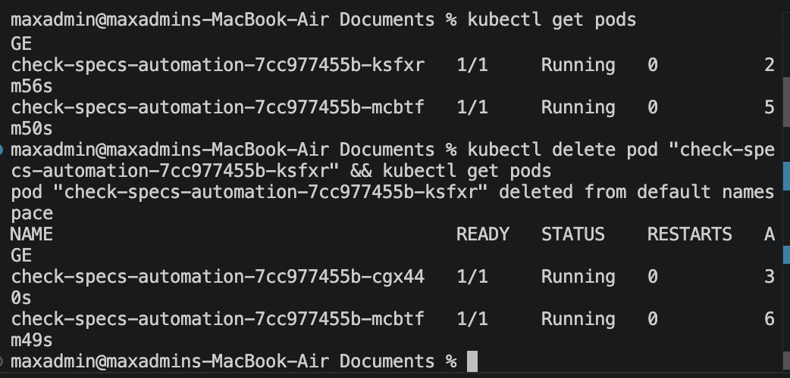
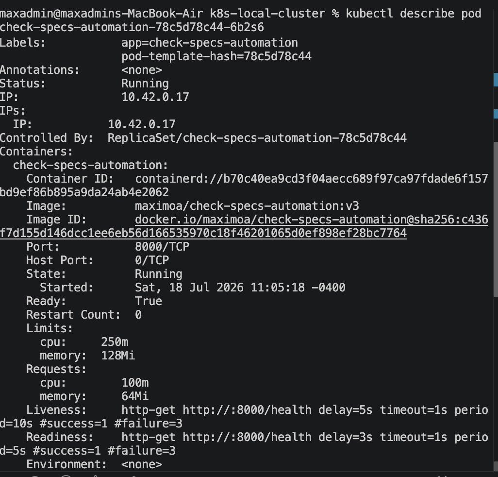

# Local K8s Cluster Running a Real App

A containerized Python automation tool deployed to a local Kubernetes cluster (k3d), wrapped in a lightweight Flask API so it can run as a long-lived, self-healing service rather than a one-shot script.

## What it does

- Runs the `check-specs-automation` tool (originally from my [Docker project](https://github.com/antiguamaximo/check-specs-automation)) as a long-running Kubernetes Deployment
- Exposes it over HTTP via a small Flask wrapper (`/run` to trigger the script, `/health` for probes)
- Routes traffic to the pods through a Kubernetes Service
- Includes readiness/liveness probes and resource requests/limits
- Demonstrates self-healing: manually killing a pod triggers automatic rescheduling


## Tech stack

- k3d (local k8s)
- Docker
- kubectl
- Flask  + Python

## How to run it

### Create the local cluster
```
k3d cluster create resume-cluster
```
### Apply the Deployment and Service
```
kubectl apply -f deployment.yaml
kubectl apply -f service.yaml
```
### Check status
```
kubectl get pods
kubectl get svc
```

### Port-forward to test locally
```
kubectl port-forward svc/check-specs-service 8080:80
```
### Open in Another Terminal
```
curl http://localhost:8080/run
```
## Architecture
```
Docker image -> k3d cluster -> Deployment (2 replicas) -> Service (ClusterIP)[routes traffic via label selector] -> Port-forward (curl)
```
## Screenshots





## What I learned

This project was my first real hands-on experience with Kubernetes, and it clarified a lot of concepts I'd only understood abstractly before. The biggest one: Kubernetes Deployments are built around long-running processes, not scripts that run once and exit. My original `check-specs-automation.py` does the latter, so applying it directly would have caused a never-ending restart loop (`CrashLoopBackOff`). Wrapping it in a small Flask app, without touching the original script, gave Kubernetes something it could actually keep alive and route traffic to.

I also got to see self-healing in action directly, rather than just reading about it: deleting a running pod manually and watching Kubernetes immediately spin up a replacement to maintain the replica count was a genuinely useful "click" moment for understanding what a Deployment actually guarantees.

Adding `readiness` and `liveness` probes clarified a distinction I hadn't thought carefully about before: readiness controls whether a pod receives traffic, while liveness controls whether Kubernetes decides a pod needs to be restarted entirely. They serve different purposes even though they're configured almost identically.

Setting resource `requests` and `limits` also showed me a scheduling concern I hadn't considered: requests are what Kubernetes uses to decide where a pod can be placed, while limits cap what a container is allowed to consume once running, so a misbehaving container can't starve its neighbors.

Finally, I ran into a handful of YAML indentation mistakes along the way, since Kubernetes manifests are strict about nesting and whitespace, a small misplaced probe or resource block either fails to apply or silently attaches to the wrong part of the spec.
